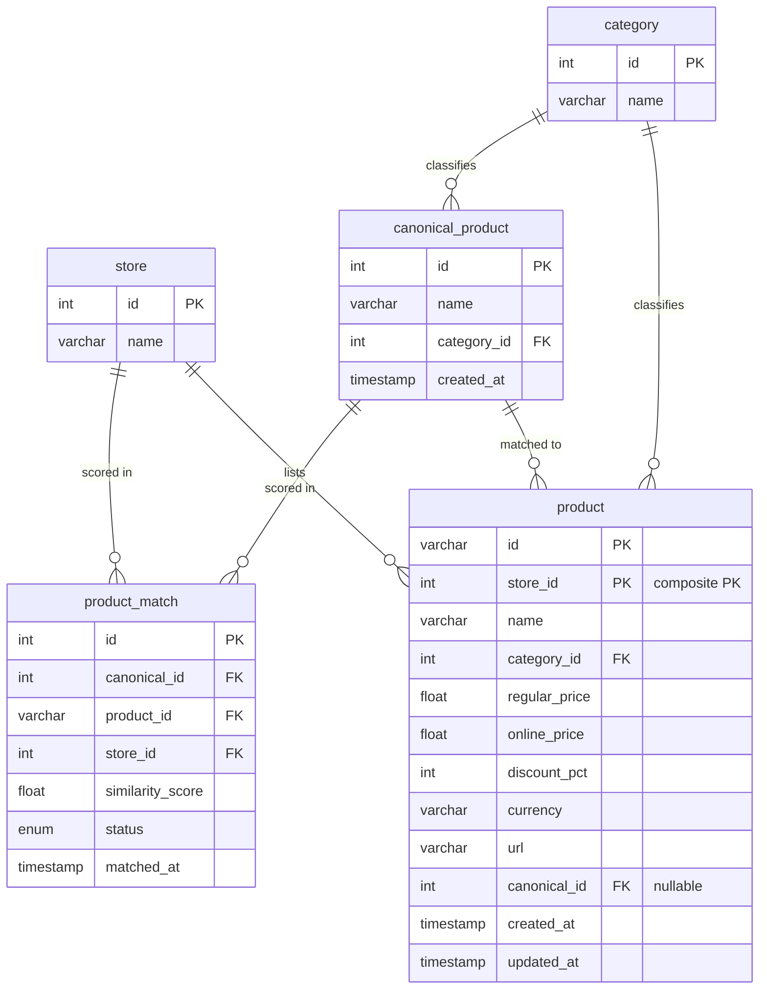
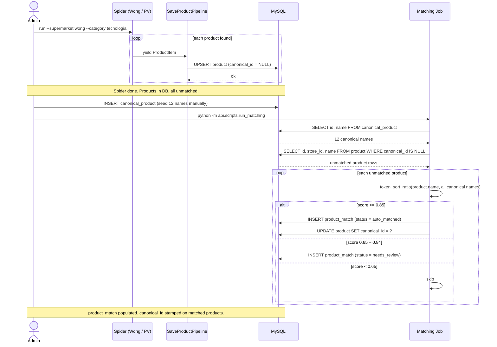
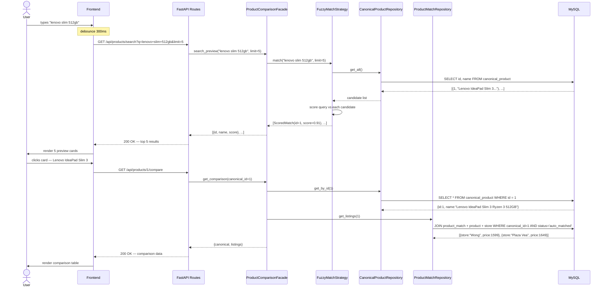

# Presio — Session Answers

> Newest session first.

---

## Session: 2026-06-07

---

### Topic 15 — Process Step Analysis & Suggested Improvements

Deep review of the post-scrape processing pipeline (`run_pipeline.py` → `normalize` → `score`, sharing `processing/text.py`).

#### How it works today

```
run_pipeline.py
 ├─ normalize(conn)                       # build canonical identities
 │   for each category with unmatched products:
 │       FuzzyClusterStrategy.canonicalize(raw_names)   # greedy 1-pass cluster @0.88
 │       → dedup representative vs existing canonicals @0.92 → INSERT canonical_product
 └─ score(conn)                           # match products → canonicals
     for each product WHERE canonical_id IS NULL:
         best canonical in same unit-spec bucket via token_sort_ratio
         ≥0.85 auto_matched (+ stamp product.canonical_id) | ≥0.65 needs_review | else skip
```

`text.py` (unit-spec vs bare-number model) is the well-designed foundation; the concerns below are about the two consumers, not the shared layer.

#### Findings by severity

| # | Severity | Finding |
|---|---|---|
| 1 | 🔴 Bug | **`score` ignores `category_id`.** `run_score.py` selects all canonicals and buckets only by unit-spec set, so a `tecnologia` product (`"Cargador 20w"`) can match a canonical in another category with the same `{20w}` spec. Fix: include `category_id` in the bucket key (both queries must select it). |
| 2 | 🟠 Design | **normalize discards its clustering; score recomputes from scratch.** Both run over the same cross-store unmatched products with the same fuzzy logic but different thresholds (0.88 cluster / 0.92 dedup vs 0.85 match). Wasteful, and can produce inconsistency: a product that *created* a canonical may later auto-match a *different* one, or fail 0.85 against its own canonical → orphan canonical. |
| 3 | 🟠 Quality | **Greedy single-pass clustering is order-dependent.** Each name compares only against each cluster's first member (`rep_norm`), stops at first ≥0.88 (single-linkage, first-fit). The matching anchor (first-seen) differs from the name chosen by `_pick_representative` (most specs). |
| 4 | 🟡 Perf | **Redundant normalization.** `unit_specs()` and `bare_numbers()` each call `normalize_name()` internally → ~3 normalizations per product and per canonical. Add `functools.lru_cache` to the pure functions in `text.py`. |
| 5 | 🟡 Quality | **`token_sort_ratio` penalizes subset names.** Cross-store listings differ by extra marketing words; `token_set_ratio`/`WRatio` handle subsets better. Unit-spec + bare-number guards already prevent classic over-matching, so worth an A/B on real data. |
| 6 | 🟡 Ops | **No observability for threshold tuning.** Step prints only totals. A `--report`/dry-run mode (score distribution, cluster-size histogram, needs_review count) makes 0.85/0.88/0.92 tuning data-driven. |
| ⚪ | Minor | `_build_index` dedups across all categories globally while inserts are per-category; bare-number conflict conflates model numbers / pack counts / screen sizes; canonical names stored as raw store strings; `run_pipeline` commits normalize before score runs. |

#### Suggested priority order

1. **#1 category isolation** in `score` — real bug, ~5 lines.
2. **#4 `lru_cache`** — free speedup, zero behavior change.
3. **#2 unify normalize/score** — removes redundancy + threshold drift (bigger refactor: strategy returns clusters, write matches in one pass).
4. **#5 `token_set_ratio` trial** + **#6 report mode** — tune thresholds with evidence.
5. **#3 order-independent clustering** — quality refinement (compare against all members / sort by spec-richness / union-find).

References: RapidFuzz scorers (https://rapidfuzz.github.io/RapidFuzz/Usage/fuzz.html); single- vs complete-linkage agglomerative clustering.

> Status: proposed only — awaiting approval before editing files (per working preferences).

#### Implemented this session

**#1 — Category isolation in `score`** (`processing/score/run_score.py`)

- Canonical query now selects `category_id`; bucket key changed from `unit_specs` to `(category_id, unit_specs)`.
- Product query now selects `category_id`; lookup uses the composite key.
- Result: a product can only match a canonical in the **same category** with the same unit-spec set, closing the cross-category false-match (e.g. a 20w charger in tecnologia vs a 20w item elsewhere). Aligns `score` with `normalize` (already per-category).
- Caveat: rows with `NULL`/mismatched `category_id` now fall in separate buckets and won't match — intended stricter behavior; may show fewer matches on next run.
- Verified: `python -m py_compile` clean.

**#4 — `lru_cache` on `text.py` pure functions** (`processing/text.py`)

- Added `from functools import lru_cache`; decorated `normalize_name`, `unit_specs`, `bare_numbers` with `@lru_cache(maxsize=100_000)`.
- Each distinct name now normalized once instead of ~3× per comparison (`unit_specs`/`bare_numbers` call `normalize_name` internally). Safe — functions are pure, args/returns hashable (`str`/`frozenset`).
- Verified: outputs match docstring examples; `cache_info()` showed a hit on a repeated call.

**#2 — Unify normalize/score into a single pass** (chosen approach: single-pass loop)

- New `processing/match/` package:
  - `strategy.py` — `CanonicalNameStrategy` ABC (`clean(raw_name) -> str`); the Phase-2 LLM hook.
  - `passthrough_strategy.py` — `PassthroughStrategy`, returns the founding product's raw name.
  - `run_match.py` — single pass: load existing canonicals into `(category, unit-spec)` buckets; for each unmatched product (spec-richest first) find best canonical → `≥0.85` auto_matched (+ stamp canonical_id), `≥0.65` needs_review, else **mint** a new canonical and self-match at 1.0.
- `run_pipeline.py` now calls the one `match` step instead of normalize → score.
- Removed obsolete modules: `processing/normalize/` and `processing/score/` (superseded). `text.py` stays as shared layer.
- Why: eliminates double fuzzy matching, the 0.88/0.92 vs 0.85 threshold drift, and orphan canonicals (a minted canonical always has its founding product matched). `needs_review` tier preserved. Processing spec-richest first folds in partial order-independence (richest name founds the canonical, sparser cross-store listings match onto it).
- Known carry-over: `token_sort_ratio` still penalizes subset names (suggestion #5) — a sparse listing may fail 0.85 vs a rich founder and mint its own canonical. No regression vs old `score`.
- Docs updated: root `CLAUDE.md` "Matching Batch" → "Processing Batch" section + Data Flow block.
- Decision recorded: chose single-pass over "keep two steps, share clusters" (user-selected).

**Key finding — cross-store coverage is the real metric, and it was very low**

User correctly challenged "0 unmatched": with 3 different store catalogs, store-unique
products must exist, so 0 unmatched is suspicious. Root cause: the mint branch gives EVERY
non-matching product its own singleton canonical (+self-match), so `canonical_id` is never
NULL after a run. "0 unmatched" therefore measures nothing. The real metric is **canonicals
matched across >=2 stores** (only those power `/compare`).

Baseline measured (`processing/report.py`): **450 / 21,813 canonicals (2.1%)** comparable.
21,363 were singletons. Per category: cat1 1.7%, cat2 2.9%, cat3 1.3%.
Products per store: PV 10,610 · Wong 3,567 · Falabella 13,496.

Root causes of under-merging: (1) bucket key required EXACT unit-spec set equality, so the
same product described with different spec formatting across stores never even got compared;
(2) `token_sort_ratio` length penalty split true twins; (3) no brand/semantic awareness.

**#5 + bucket relax — implemented**

- `text.py` `spec_conflict`: exact-equality → **subset** semantics (one store omitting a spec
  no longer conflicts; genuine value disagreements still do).
- `run_match.py`: bucket by **category only** (spec_conflict does the rejecting); score with
  `token_set_ratio` instead of `token_sort_ratio`.
- **#6 report mode**: `processing/report.py` (`python -m processing.report`) — read-only
  coverage metrics (the ≥2-store %), per category.

Projected impact (non-destructive in-memory simulation over all 27,673 products):
canonicals 21,813 → 9,667 (−56%); **comparable 2.1% → 7.7% (~3.6×)**; cat1 6.3%, cat2 10.5%,
cat3 7.3%. Also surfaced 8,619 products (31%) in the 0.65–0.84 review band — the next
opportunity (threshold tuning / synonyms / embeddings).

**Full rematch — applied 2026-06-07**

Backed up `product`/`product_match`/`canonical_product` to `backup_presio_20260607_181541.sql`
(9.6M), then cleaned (FK-safe: NULL `product.canonical_id` → delete `product_match` →
delete `canonical_product`) and re-ran `processing.run_pipeline` over all 27,673 products.

Run: 6,505 auto-matched, 7,464 minted, **13,704 needs_review (49.5%)**.
Actual coverage (matches the ~7.7% projection): canonicals 21,813 → 7,464 (−66%);
**comparable ≥2 stores 450 (2.1%) → 546 (7.3%)**; cat1 5.8%, cat2 10.2%, cat3 6.7%;
ratio 1.27 → 3.71 products/canonical.

Next lever: the 13,704-product needs_review band (0.65–0.84) is now the dominant opportunity
— threshold tuning / brand-synonym normalization / embeddings would convert many true twins
into confirmed matches and lift comparable coverage further.

---

### Topic 14 — Codebase Analysis & Summary

Full read-through of the `baruch-backend` monorepo (internally still named "presio").

#### Structure

```
baruch-backend/
├── apps/
│   ├── baruch-scraper/        ← Scrapy batch: scraping + processing pipeline
│   └── baruch-catalog-api/    ← FastAPI read-only web service
├── packages/db/               ← SQL migrations + dbdiagram schema
└── CLAUDE.md
```

#### Three logical components

| Component | Responsibility | Writes |
|---|---|---|
| Scraper (`baruch-scraper`) | Collect raw products from Wong (Playwright scroll), Plaza Vea (VTEX REST API), Falabella | `product` table (`canonical_id = NULL`) |
| Processing (`processing/`) | normalize → canonical_product; score → product_match + stamp canonical_id | `canonical_product`, `product_match`, `product.canonical_id` |
| API (`baruch-catalog-api`) | `/search` (in-memory rapidfuzz over canonical cache), `/{id}/compare` (join through product_match) | nothing (read-only) |

#### Strengths

- Clean component boundaries; Strategy pattern for canonicalization (swappable for LLM/embeddings).
- Shared pure-function text layer (`text.py`) as single source of truth for normalization, with strong docstrings.
- Performance-aware unit-spec bucketing avoids O(n²) fuzzy scans.
- Pragmatic per-store scraping (API when available, browser only when forced).

#### Issues found

1. **Hardcoded DB credentials** (committed password) in `pipelines.py`, `processing/run_pipeline.py`, `api/db.py` — highest-priority fix; move to env/shared config.
2. Naming drift: code/DB say "presio", repo is "baruch".
3. `@app.on_event("startup")` is deprecated — use FastAPI `lifespan`.
4. API search is a full linear scan, cache loaded once at startup (stale after new canonicals).
5. API has no Repository/Facade layer yet — raw SQL inline, behind the documented design.
6. Stray artifacts committed (`out.json`, `*.html`, `nohup.out`, `*.log`) — belong in `.gitignore`.

References: *Clean Architecture* (Martin); *PoEAA* (Fowler — Repository/Service Layer); Scrapy, scrapy-playwright, VTEX Catalog API, RapidFuzz docs.

---

## Session: 2026-05-25

---

### Topic 13 — Pipeline Execution Results

#### What ran

```bash
# From presio-scrapy-batch/
conda run -n presio python -m processing.run_pipeline
```

Output:
```
=== Step 1: Normalize ===
Normalize done — 0 new canonical products inserted.

=== Step 2: Score ===
Matching 2114 products against 7639 canonicals...
Matching done.

Pipeline complete.
```

#### DB state after run

| Table | Count | Notes |
|---|---|---|
| `canonical_product` | 7,639 | Pre-existing from a previous session — normalize found 0 new clusters |
| `product_match` | 13,755 | Cumulative across runs |
| `product_match` auto_matched | 11,642 | Used by `/compare` endpoint |
| `product_match` needs_review | 2,113 | Scored 0.65–0.84, awaiting manual review |
| `product` (canonical_id IS NULL) | 2,114 | Most scored below 0.85 — no canonical_id stamped this run |

#### Why normalize inserted 0

`canonical_product` already had 7,639 rows from a previous session. The `_already_exists` check (threshold 0.90) found every new cluster already represented — so no new rows were needed. Normalize is idempotent by design.

#### API readiness

The API will work because:
- `/search` — loads 7,639 canonical names into cache at startup, scores in memory
- `/compare` — queries `product_match` WHERE `status = 'auto_matched'` — 11,642 rows available

`product.canonical_id` being NULL does not block the API — the `/compare` endpoint joins through `product_match`, not through `product.canonical_id`.

---

### Topic 12 — Canonicalization Auto-Feed Strategy

#### Problem

`canonical_product` cannot be seeded manually at scale — millions of products make it impossible. The pipeline must auto-generate canonical names from scraped data.

#### Solution: CanonicalizationStrategy (swappable)

A Strategy pattern inside `presio-scrapy-batch/processing/normalize/`:

```
normalize/
  strategy.py               ← CanonicalizationStrategy ABC
  fuzzy_cluster_strategy.py ← Phase 1: fuzzy clustering
  run_normalize.py          ← orchestrator, calls strategy
```

#### Phase 1 — FuzzyClusterStrategy (current)

1. Group raw product names by `token_sort_ratio >= 0.80` within each category
2. Pick the shortest name per cluster as the canonical
3. Skip if a very similar canonical already exists (`>= 0.90`)

#### Phase 2 — LLM (future, no code change in orchestrator)

```python
# Only the strategy changes — run_normalize.py stays identical
normalize(conn, strategy=LLMCanonicalizationStrategy())
```

The LLM receives raw product names and returns a clean, store-agnostic canonical name — handles abbreviations, accents, embedded SKU codes, Spanish/English mix.

#### Scale reference

| Phase | Max products | Approach |
|---|---|---|
| 1 (fuzzy) | ~50k | In-memory clustering, no external API |
| 2 (LLM) | Unlimited | Batch API calls, cost per token |

---

### Topic 11 — Processing Pipeline Structure

#### Directory layout

```
presio-scrapy-batch/
  processing/
    run_pipeline.py          ← orchestrator: runs normalize then score
    normalize/               ← was: canonicalization/
      strategy.py            ← CanonicalizationStrategy ABC
      fuzzy_cluster_strategy.py
      run_normalize.py       ← step 1: fills canonical_product
    score/                   ← was: matching/
      run_score.py           ← step 2: fills product_match
```

#### Run command

```bash
# From presio-scrapy-batch/
conda run -n presio python -m processing.run_pipeline
```

#### Why this structure

| Principle | Application |
|---|---|
| SRP | Each file has one job — normalize and score stay separate |
| Cohesion | Both are post-scrape steps — same `processing/` directory |
| Open/Closed | Swap `FuzzyClusterStrategy` for `LLMStrategy` without touching `run_pipeline.py` |
| Single entry point | One command for the full post-scrape pipeline |

---

### Topic 10 — Simplified presio-api

#### Why simplified

For the MVP, the full Clean Architecture (Facade + Strategy + Repositories) added indirection without immediate benefit. The simplified version is easier to read, debug, and understand.

#### Structure

```
presio-api/
  main.py          ← FastAPI app + startup cache loader
  db.py            ← single DB connection function
  routes/
    products.py    ← /search and /{id}/compare
  requirements.txt
```

#### In-memory cache

`canonical_product` is loaded once at startup into a Python list. Every `/search` request scores the query against this list in Python — zero extra DB calls.

```python
@app.on_event("startup")
def load_canonical_cache():
    cur.execute("SELECT id, name FROM canonical_product")
    canonical_cache.extend(cur.fetchall())
    # e.g. "Cache loaded — 7639 canonical products ready."
```

#### Memory footprint

| Products | RAM |
|---|---|
| 10k | ~2 MB |
| 50k | ~10 MB |
| 100k | ~20 MB |

Fine for any MVP deployment.

#### Search scoring — how "in-memory" works

```
GET /search?q=laptop+lenovo+5G

1. Load 7,639 names from cache (already in RAM — no DB call)
2. Python loop: token_sort_ratio("laptop lenovo 5G", each name)
3. Sort by score desc, return top 5
Total: ~10–30ms
```

#### API run command

```bash
# From presio-api/
conda run -n presio uvicorn main:app --reload
# Docs UI: http://localhost:8000/docs
```

---

### Topic 9 — Data Model

#### Entity Relationship Diagram (Mermaid)



#### ASCII Quick Reference

```
┌──────────┐        ┌──────────────────┐        ┌──────────────────────────┐
│  store   │        │    category      │        │    canonical_product     │
│──────────│        │──────────────────│        │──────────────────────────│
│ id    PK │        │ id    PK         │        │ id          PK           │
│ name     │        │ name             │        │ name  (FULLTEXT indexed) │
└────┬─────┘        └───┬──────────────┘        │ category_id FK→category  │
     │                  │                        │ created_at               │
     │           ┌──────┤                        └──────────┬───────────────┘
     │           │      │                                   │
     │    ┌──────▼──────▼──────────────────────────────┐   │
     │    │                  product                    │   │
     │    │────────────────────────────────────────────│   │
     │    │ id            PK (composite with store_id) │   │
     ├────► store_id      FK → store                   │   │
     │    │ name                                        │   │
     │    │ category_id   FK → category                 │   │
     │    │ regular_price                               │   │
     │    │ online_price                                │   │
     │    │ discount_pct                                │   │
     │    │ currency                                    │   │
     │    │ url                                         │   │
     │    │ canonical_id  FK → canonical_product (NULL) ◄───┘
     │    │ created_at                                  │
     │    │ updated_at                                  │
     │    └──────────────────┬──────────────────────────┘
     │                       │
     │    ┌──────────────────▼──────────────────────────┐
     │    │               product_match                  │
     │    │─────────────────────────────────────────────│
     │    │ id               PK                          │
     │    │ canonical_id     FK → canonical_product      │
     │    │ product_id       FK → product.id             │
     ├────► store_id         FK → store                  │
     │    │ similarity_score FLOAT                       │
     │    │ status           auto_matched | needs_review │
     │    │ matched_at                                   │
     │    │ UNIQUE (canonical_id, product_id, store_id)  │
     │    └──────────────────────────────────────────────┘
     │
```

#### Relationships explained

| Relationship | Cardinality | Meaning |
|---|---|---|
| `store` → `product` | 1:N | One store has many scraped products |
| `category` → `product` | 1:N | One category classifies many products |
| `category` → `canonical_product` | 1:N | One category classifies many canonical names |
| `canonical_product` → `product` | 1:N | One canonical identity matched to N store listings |
| `canonical_product` → `product_match` | 1:N | One canonical has N similarity scores (one per store) |
| `store` → `product_match` | 1:N | One store appears in N match rows |

#### Key design decisions

| Decision | Why |
|---|---|
| `product` PK is `(id, store_id)` | Same raw product id can exist across stores |
| `canonical_id` is nullable on `product` | NULL = not yet matched by the Matching Batch |
| `product_match` has UNIQUE `(canonical_id, product_id, store_id)` | Prevents duplicate scores; safe to re-run matching job |
| `canonical_product.name` has FULLTEXT index | Enables fast full-text search from the API |
| `status` ENUM in `product_match` | Separates confident matches from ones needing human review |

---

### Topic 8 — Components vs Artifacts; Product Match Ownership; Project Rename

#### Components vs Artifacts

A **component** is a deployable unit — something you could package, version, and deploy
independently. It has a single responsibility and a clear boundary.

An **artifact** is an implementation detail _inside_ a component: a class, a file, a function.
Artifacts are not deployable on their own.

| Item | Type | Why |
|---|---|---|
| `presio-scrapy-batch` (the whole scraper project) | Component | Deployable independently; runs on a schedule |
| `presio-api` (the whole FastAPI project) | Component | Deployable independently; serves HTTP |
| `WongSpider` | Artifact | Implementation detail inside Scraper Batch |
| `PlazaVeaSpider` | Artifact | Implementation detail inside Scraper Batch |
| `SaveProductPipeline` | Artifact | Implementation detail inside Scraper Batch |
| `FuzzyMatchStrategy` | Artifact | Implementation detail inside Matching Batch |
| `ProductComparisonFacade` | Artifact | Implementation detail inside Presio API |
| `CanonicalProductRepository` | Artifact | Implementation detail inside Presio API |

> Spiders and pipelines are **not** components — they are files inside a component.

#### Who Owns `product_match`?

The **Matching Batch** owns `product_match`. Only it writes rows to that table.

Reason: the Scraper Batch has no knowledge of canonical products — it scrapes raw data
and persists it with `canonical_id = NULL`. The API is read-only and never writes.
The Matching Batch is the only component with context to compute similarity scores.

```text
Scraper Batch  →  writes: product (canonical_id = NULL)
Matching Batch →  reads:  product (WHERE canonical_id IS NULL), canonical_product
                  writes: product_match, product.canonical_id
Presio API     →  reads:  all tables. Writes nothing.
```

#### Project Rename Plan

| Old name | New name | Responsibility |
|---|---|---|
| `presio/` (Scrapy project) | `presio-scrapy-batch` | Spider + Pipeline + Matching Job |
| `api/` (planned) | `presio-api` | FastAPI read-only service |

The monorepo root (`presio-product-api`) stays as the umbrella repo holding both projects.

---

### Topic 7 — Clean Architecture

#### The Four Circles

Robert C. Martin's Clean Architecture organizes code into four concentric rings.
The fundamental rule: **dependencies point inward only** — outer layers know about inner
layers, inner layers know nothing about outer layers.

```text
┌──────────────────────────────────────────────────┐
│  Frameworks & Drivers  (outermost)               │
│  FastAPI, MySQL, rapidfuzz, Scrapy, Playwright   │
│  ┌────────────────────────────────────────┐      │
│  │  Interface Adapters                    │      │
│  │  Repositories, Strategy impls, Routes  │      │
│  │  ┌──────────────────────────────┐      │      │
│  │  │  Use Cases                   │      │      │
│  │  │  ProductComparisonFacade     │      │      │
│  │  │  ┌────────────────────┐      │      │      │
│  │  │  │  Entities          │      │      │      │
│  │  │  │  ScoredMatch       │      │      │      │
│  │  │  │  CanonicalProduct  │      │      │      │
│  │  │  └────────────────────┘      │      │      │
│  │  └──────────────────────────────┘      │      │
│  └────────────────────────────────────────┘      │
└──────────────────────────────────────────────────┘
```

#### Mapping to Presio

| Circle | Layer | Presio artifact |
|---|---|---|
| Entities | Core domain objects, no external deps | `ScoredMatch`, `CanonicalProduct` (plain dataclasses) |
| Use Cases | Business logic, depends only on abstractions | `ProductComparisonFacade` |
| Interface Adapters | Translate between Use Cases and Frameworks | `CanonicalProductRepository`, `ProductMatchRepository`, `FuzzyMatchStrategy`, FastAPI `Routes` |
| Frameworks & Drivers | External tools, swappable | MySQL, FastAPI, rapidfuzz, Scrapy, Playwright |

#### Dependency Rule Applied

```python
# GOOD — Use Case depends on abstraction (MatchStrategy ABC), not on rapidfuzz
class ProductComparisonFacade:
    def __init__(self, strategy: MatchStrategy, ...):  # injects the interface
        self.strategy = strategy

# BAD — Use Case imports a concrete framework class (violates dependency rule)
from rapidfuzz import fuzz
class ProductComparisonFacade:
    def search(self, query):
        fuzz.token_sort_ratio(...)  # Facade now depends on rapidfuzz directly
```

#### Current Presio Design vs Clean Architecture

The current design is **~80% aligned**. The Facade + Strategy + Repository pattern
already respects most of the dependency rule. The only practical gap is that if `Facade`
directly imports the concrete `FuzzyMatchStrategy` (instead of receiving it via dependency
injection), it crosses a layer boundary.

For a project at this stage that is fine — the pattern gives you 80% of the benefit
(testability, swappability) without needing a full DI container. The gap closes naturally
when you wire the components in a `main.py` / `lifespan` that instantiates and injects
the concrete implementations.

#### Why it matters for Presio

- You can swap `rapidfuzz` for a semantic embeddings model by implementing a new
  `SemanticMatchStrategy` — the Facade and Routes don't change.
- You can swap MySQL for PostgreSQL by reimplementing the Repositories — the Facade
  doesn't change.
- Tests can inject a `FakeRepository` and a `FakeStrategy` — no real DB or HTTP needed.

---

## Session: 2026-05-24

---

### Topic 6 — Full Application Design: Components, Responsibilities & Sequence Diagrams

#### Component Map

```text
┌─────────────────────────────────────────────────────────────────────┐
│                          PRESIO SYSTEM                              │
│                                                                     │
│  ┌─────────────────────────┐   ┌───────────────────────────────┐   │
│  │     SCRAPER (presio/)   │   │         API  (api/)           │   │
│  │                         │   │                               │   │
│  │  ┌─────────┐            │   │  ┌────────┐                  │   │
│  │  │  Wong   │            │   │  │ Routes │                  │   │
│  │  │ Spider  │            │   │  └───┬────┘                  │   │
│  │  └────┬────┘            │   │      │                       │   │
│  │       │  yield Item     │   │  ┌───▼────────┐             │   │
│  │  ┌────▼────┐            │   │  │  Facade    │             │   │
│  │  │PlazaVea │            │   │  └───┬────────┘             │   │
│  │  │ Spider  │            │   │      │                       │   │
│  │  └────┬────┘            │   │  ┌───▼──────┐  ┌─────────┐ │   │
│  │       │                 │   │  │ Strategy │  │  Repos  │ │   │
│  │  ┌────▼────┐            │   │  └──────────┘  └────┬────┘ │   │
│  │  │Pipeline │            │   │                      │      │   │
│  │  └────┬────┘            │   │  ┌───────────────┐   │      │   │
│  └───────┼─────────────────┘   │  │ Matching Job  │   │      │   │
│          │                     │  └───────┬───────┘   │      │   │
└──────────┼─────────────────────┴──────────┼───────────┼──────┘   │
           │                                │           │            │
           └────────────────┬───────────────┘           │            │
                            │◄──────────────────────────┘            │
                     ┌──────▼───────┐                                │
                     │   MySQL DB   │                                │
                     │─────────────│                                │
                     │ store        │                                │
                     │ category     │                                │
                     │ product      │                                │
                     │ canonical_   │                                │
                     │   product    │                                │
                     │ product_     │                                │
                     │   match      │                                │
                     └──────────────┘                                │
```

#### Component Responsibilities

| # | Component | Layer | Responsibility |
|---|---|---|---|
| 1 | **WongSpider** | Scraper | Navigates Wong pages with Playwright. Yields `ProductItem` per product. Owns pagination and scroll logic. |
| 2 | **PlazaVeaSpider** | Scraper | Calls Plaza Vea REST API. Yields `ProductItem` per product. Owns pagination. |
| 3 | **SaveProductPipeline** | Scraper | Receives `ProductItem`, validates, upserts into `product` table. Sets `canonical_id = NULL`. Owns DB write for raw products. |
| 4 | **MySQL Database** | Storage | Single source of truth. Holds all 5 tables. Neither scraper nor API duplicates data. |
| 5 | **Matching Job** | Background | Reads unmatched products, scores against canonical names, writes `product_match`, stamps `canonical_id` on product. |
| 6 | **CanonicalProductRepository** | API / Data | All SQL against `canonical_product`. No SQL lives outside this class. |
| 7 | **ProductMatchRepository** | API / Data | All SQL against `product_match JOIN product JOIN store`. Returns comparison listings. |
| 8 | **FuzzyMatchStrategy** | API / Matching | Implements `MatchStrategy`. Uses `rapidfuzz.token_sort_ratio`. Swappable for semantic strategy later. |
| 9 | **ProductComparisonFacade** | API / Service | Orchestrates both flows. Calls Strategy for search, Repos for comparison. The only class Routes talk to. |
| 10 | **Routes** | API / HTTP | Defines `GET /search` and `GET /{id}/compare`. Validates HTTP input. Delegates everything to Facade. |
| 11 | **Frontend** | Client | Debounces user input, renders preview cards and comparison table. Two API calls per user session. |

#### Architecture Boundaries

```text
Scraper   →  writes product table only. Never reads canonical_product.
Matching  →  reads product + canonical_product. Writes product_match + canonical_id.
API       →  reads everything. Writes nothing (read-only layer).
Frontend  →  two calls only: search then compare. No direct DB access.
```

#### Sequence Diagram A — Data Collection + Matching (background)



#### Sequence Diagram B — User Search + Compare (real-time)



#### Single Responsibility per Component

| Component | Changes only when… |
|---|---|
| Spider | Store website HTML/API changes |
| Pipeline | DB schema of `product` changes |
| Matching Job | Threshold or algorithm changes |
| Strategy | Matching library changes |
| Facade | Business flow changes |
| Repository | SQL query changes |
| Routes | HTTP contract changes |

---

### Topic 5 — Frontend Product Comparison Feature — Architecture Design

#### Overview

The feature lets a user type a generic product name (e.g. `"laptop samsung 5GB"`), see a preview
of the top 5 most similar canonical products, select one, and view a price comparison table across
all available stores.

**This document covers:**
1. Schema design (3 tables)
2. Design patterns
3. API contract
4. Frontend flow
5. Matching threshold strategy
6. Edge cases — low scores, missing stores

---

#### 1. Schema Design

The original idea (`productMatchStores` with `id_store1`, `id_store2`) was discarded because it
hardcodes exactly 2 stores — adding a 3rd store requires `ALTER TABLE`.

The solution introduces a **canonical product** as the central concept: a normalized, store-agnostic
product identity that N store listings can map to.

##### Table: `canonical_product`

The logical product, independent of any store.

```sql
CREATE TABLE canonical_product (
  id          INT PRIMARY KEY AUTO_INCREMENT,
  name        VARCHAR(255) NOT NULL,
  category_id INT NOT NULL,
  created_at  TIMESTAMP DEFAULT NOW(),
  FOREIGN KEY (category_id) REFERENCES category(id),
  FULLTEXT(name)
);
```

Sample rows:

| id | name | category_id | created_at |
|---|---|---|---|
| 1 | Lenovo IdeaPad Slim 3 Ryzen 3 512GB SSD 8GB 15.6" | 1 | 2025-05-17 |
| 2 | Lenovo IdeaPad Slim 3i Core i5 512GB SSD 8GB 15.3" | 1 | 2025-05-17 |
| 3 | HP Laptop Ryzen 3 512GB SSD 16GB 15.6" | 1 | 2025-05-17 |
| 4 | Samsung TV 55" Crystal UHD U8000F Smart TV | 1 | 2025-05-17 |
| 5 | Samsung TV 55" QLED Q7F Smart TV | 1 | 2025-05-17 |
| 6 | Epson Impresora Multifuncional L3250 | 1 | 2025-05-17 |

> **Rule:** names are hand-written or produced by a normalization script.
> They must **not** be raw store titles — those vary too much per store.

##### Table: `product` (existing, extended with `canonical_id`)

Each row is one store's scraped listing. `canonical_id` links it to the logical product.
`NULL` means the row has not been matched yet.

```sql
ALTER TABLE product ADD COLUMN canonical_id INT NULL,
  ADD FOREIGN KEY (canonical_id) REFERENCES canonical_product(id);
```

Sample rows (real Wong names + estimated Plaza Vea equivalents):

| id | store_id | canonical_id | product_name (raw from scraper) | online_price | scraped_at |
|---|---|---|---|---|---|
| 1094631 | 2 (Wong) | 1 | Notebook Lenovo IdeaPad Slim 3 W11 82XQ0060LM 15.6" FHD Ryzen 3 512GB | 1599.00 | 2025-05-17 |
| 8830012 | 1 (PV) | 1 | Lenovo IdeaPad Slim 3 Gen 8 15" Ryzen 3 8GB RAM 512GB SSD W11 | 1649.00 | 2025-05-17 |
| 1093626 | 2 (Wong) | 2 | Notebook Lenovo IdeaPad Slim 3i W11 83K100NTLM 15.3" i5-13420H 512GB | 1999.00 | 2025-05-17 |
| 8830013 | 1 (PV) | 2 | Lenovo IdeaPad Slim 3i 15.3" Core i5 8GB 512GB SSD | 2049.00 | 2025-05-17 |
| 1096268 | 2 (Wong) | 3 | Laptop HP W11 15-fc0043la 15.6" FHD AMD Ryzen 3-7320U 512GB SSD 16GB | 1599.00 | 2025-05-17 |
| 8841005 | 1 (PV) | 3 | HP Laptop 15 AMD Ryzen 3 16GB RAM 512GB SSD Windows 11 | 1629.00 | 2025-05-17 |
| 1083594 | 2 (Wong) | 4 | Televisor Samsung 55" Crystal UHD U8000F Smart TV (2025) | 1349.00 | 2025-05-17 |
| 8820044 | 1 (PV) | 4 | Samsung 55" AU8000 Crystal UHD 4K Smart TV | 1399.00 | 2025-05-17 |
| 938136 | 2 (Wong) | 6 | Epson Impresora Multifuncional Inalámbrica L3250 | 729.00 | 2025-05-17 |
| 8800099 | 1 (PV) | 6 | Epson EcoTank L3250 Multifuncional Inalámbrica | 749.00 | 2025-05-17 |

> **Note:** Wong product `1082867` (Samsung 55" QLED Q7F) has `canonical_id = NULL` because the
> matching job has not yet found a confident Plaza Vea counterpart.

##### Table: `product_match` (similarity cache)

Stores the similarity score between each scraped listing and its canonical. Tracks confidence
status so uncertain matches can be queued for review.

```sql
CREATE TABLE product_match (
  id                INT PRIMARY KEY AUTO_INCREMENT,
  canonical_id      INT NOT NULL,
  product_id        VARCHAR(50) NOT NULL,
  store_id          INT NOT NULL,
  similarity_score  FLOAT NOT NULL,
  status            ENUM('auto_matched','needs_review','no_match')
                    NOT NULL DEFAULT 'needs_review',
  matched_at        TIMESTAMP DEFAULT NOW(),
  FOREIGN KEY (canonical_id) REFERENCES canonical_product(id),
  FOREIGN KEY (store_id)     REFERENCES store(id)
);
```

Sample rows (3 stores to illustrate N-store scalability):

| id | canonical_id | product_id | store_id | similarity_score | status |
|---|---|---|---|---|---|
| 1 | 1 | 1094631 | 2 | 0.93 | auto_matched |
| 2 | 1 | 8830012 | 1 | 0.88 | auto_matched |
| 3 | 1 | TT990012 | 3 | 0.76 | needs_review ← Tottus |
| 4 | 2 | 1093626 | 2 | 0.91 | auto_matched |
| 5 | 2 | 8830013 | 1 | 0.85 | auto_matched |
| 6 | 2 | TT990013 | 3 | 0.61 | needs_review |
| 7 | 4 | 1083594 | 2 | 0.94 | auto_matched |
| 8 | 4 | 8820044 | 1 | 0.79 | auto_matched |
| 9 | 6 | 938136 | 2 | 0.97 | auto_matched |
| 10 | 6 | 8800099 | 1 | 0.84 | auto_matched |

> Each `canonical_id` has one row per store. With 3 stores and 6 canonical products you get at
> most 18 rows. Adding store #4 requires zero schema changes — just new rows.

---

#### 2. Matching Threshold Strategy

The matching job runs nightly and uses similarity scores (0.0–1.0) to decide whether a scraped
product is the same as a canonical product across stores.

##### Score thresholds

| Score range | Status | Action |
|---|---|---|
| >= 0.85 | `auto_matched` | Insert row, set `product.canonical_id` |
| 0.65 – 0.84 | `needs_review` | Insert row, queue for manual confirmation |
| < 0.65 | *(skip)* | No row inserted |

##### Matching job logic

```python
THRESHOLD_AUTO   = 0.85
THRESHOLD_REVIEW = 0.65

for store_product in unmatched_products:
    score = fuzzy_match(canonical.name, store_product.name)

    if score >= THRESHOLD_AUTO:
        insert_match(status='auto_matched', score=score)
        # UPDATE product SET canonical_id = canonical.id
    elif score >= THRESHOLD_REVIEW:
        insert_match(status='needs_review', score=score)
    # else: skip silently — product genuinely not sold by that store
```

##### What happens when all scores are low?

**Case A — Product not sold by a specific store (most common)**

E.g. Samsung TV 55" exists in Wong but Plaza Vea only carries the 50" version.
No `product_match` row is created for Plaza Vea. The API marks it as unavailable:

| Store | Price | Status |
|---|---|---|
| Wong | S/1349 | available |
| Plaza Vea | — | not_available |

**Case B — All stores score low (canonical name too generic)**

If ALL stores return scores < 0.65, no `product_match` rows are created and the canonical
product is invisible in search results. This signals the canonical name needs better normalization.

Detect it with a nightly monitoring query:

```sql
SELECT cp.id, cp.name
FROM canonical_product cp
LEFT JOIN product_match pm ON pm.canonical_id = cp.id
WHERE pm.id IS NULL;
-- returns canonicals with zero confirmed matches
```

##### Comparison query (only `auto_matched` rows)

```sql
SELECT s.name AS store, p.online_price, p.product_url
FROM canonical_product cp
JOIN product_match pm ON pm.canonical_id = cp.id
                      AND pm.status = 'auto_matched'
JOIN product p        ON p.id = pm.product_id
                      AND p.store_id = pm.store_id
JOIN store s          ON s.id = pm.store_id
WHERE cp.id = ?
```

---

#### 3. Design Patterns

##### Repository Pattern

All database access goes through repository classes. No SQL outside them.

```python
class CanonicalProductRepository:
    def search(self, query: str, limit: int = 5) -> list[CanonicalProduct]: ...
    def get_with_listings(self, canonical_id: int) -> CanonicalProduct: ...

class ProductRepository:
    def find_unmatched(self) -> list[Product]: ...
    def link_to_canonical(self, product_id, store_id, canonical_id, score): ...
```

> **Why:** decouples business logic from SQL. Swapping MySQL for another DB later requires
> changing only the repository, not the service layer.

##### Strategy Pattern

Matching algorithm is swappable without changing callers.

```python
class MatchStrategy(ABC):
    @abstractmethod
    def match(self, query: str, candidates: list[str]) -> list[ScoredMatch]: ...

class FullTextMatchStrategy(MatchStrategy): ...    # MySQL MATCH AGAINST
class FuzzyMatchStrategy(MatchStrategy):    ...    # rapidfuzz token_sort_ratio
class SemanticMatchStrategy(MatchStrategy): ...    # sentence-transformers (future)

class ProductSearchService:
    def __init__(self, strategy: MatchStrategy):
        self.strategy = strategy

    def top_matches(self, query: str, limit=5) -> list[ScoredMatch]:
        candidates = self.repo.get_all_canonical_names()
        return self.strategy.match(query, candidates)[:limit]
```

> **Why:** start with `FuzzyMatchStrategy` (fast, no GPU). Upgrade to Semantic later without
> touching the API layer.

##### Facade Pattern

One clean entry point for the two-step comparison flow.

```python
class ProductComparisonFacade:
    def search_preview(self, query: str) -> list[CanonicalProduct]:
        """Step 1: returns top 5 canonical matches for the preview panel."""
        ...

    def get_comparison(self, canonical_id: int) -> ComparisonResult:
        """Step 2: returns price table across all stores."""
        ...
```

> **Why:** the controller/view only talks to this facade. Internal changes to search or matching
> logic don't leak into the API layer.

---

#### 4. API Contract

##### Endpoint 1 — Search preview

Debounced; called while the user types.

```
GET /api/products/search?q=laptop+samsung&limit=5
```

Response `200 OK`:

```json
[
  {
    "id": 1,
    "name": "Lenovo IdeaPad Slim 3 Ryzen 3 512GB SSD 8GB 15.6\"",
    "category": "tecnologia",
    "min_price": 1599.00,
    "store_count": 2
  }
]
```

##### Endpoint 2 — Price comparison

Called when the user selects a result from the preview.

```
GET /api/products/{canonical_id}/compare
```

Response `200 OK`:

```json
{
  "canonical": {
    "id": 1,
    "name": "Lenovo IdeaPad Slim 3 Ryzen 3 512GB SSD 8GB 15.6\""
  },
  "listings": [
    {
      "store": "Wong",
      "price": 1599.00,
      "url": "https://www.wong.pe/notebooks-lenovo-ideapad-slim-3-...",
      "scraped_at": "2025-05-17T03:12:00",
      "status": "available"
    },
    {
      "store": "Plaza Vea",
      "price": 1649.00,
      "url": "https://www.plazavea.com.pe/lenovo-ideapad-slim-3-...",
      "scraped_at": "2025-05-17T04:05:00",
      "status": "available"
    },
    {
      "store": "Tottus",
      "price": null,
      "url": null,
      "status": "not_available"
    }
  ]
}
```

---

#### 5. Frontend Flow

```text
[Input box]  user types "notebook lenovo slim 512gb"
                  │
                  │  debounce 300ms (don't hit API on every keystroke)
                  ▼
     GET /api/products/search?q=notebook+lenovo+slim+512gb
                  │
                  ▼
     Preview panel (5 cards):
       1. Lenovo IdeaPad Slim 3 Ryzen 3 512GB  — from S/1599 — 2 stores
       2. Lenovo IdeaPad Slim 3i Core i5 512GB — from S/1999 — 2 stores
       3. HP Laptop Ryzen 3 512GB SSD 16GB     — from S/1599 — 2 stores
       ...
                  │
                  │  user clicks card #1
                  ▼
     GET /api/products/1/compare
                  │
                  ▼
     Comparison table:
       Store      │ Price    │ Link
       ───────────┼──────────┼──────────────────
       Wong       │ S/1599   │ Ver en Wong
       Plaza Vea  │ S/1649   │ Ver en Plaza Vea
       Tottus     │ —        │ No disponible
```

---

#### 6. Phased Build Plan

| Phase | What to build |
|---|---|
| 1 | `canonical_product` table + `canonical_id` FK on `product` |
| 2 | Nightly matching job (`rapidfuzz`, populates `product_match`) |
| 3 | Two API endpoints (search + compare) |
| 4 | Frontend: search box → debounced preview → comparison table |

---

## Session: 2026-05-18

---

### Topic 1 — VTEX SPA React Hydration Cycle

#### What is "hydration"?

When you visit a VTEX store page, the server sends pre-rendered HTML (so you see content instantly).
But that HTML is "dead" — no interactivity. React then hydrates it: attaches event listeners,
initializes state, and takes control. This two-step process is the source of the page-2 crash bug.

#### Full lifecycle diagram

```text
BROWSER                          SERVER / CDN                    PLAYWRIGHT
───────                          ────────────                    ──────────

  GET /tecnologia?page=2 ──────────────────────────────►
                          ◄─────────────── SSR HTML response
                                          (pre-rendered product cards,
                                           no JS running yet)

  ┌─────────────────────────────────────────────────────┐
  │  PHASE 1 — INITIAL PAINT                            │
  │                                                     │
  │  DOM tree built from SSR HTML                       │
  │  [data-af-element="search-result"] EXISTS in DOM    │◄─── wait_for_selector()
  │  BUT: zero JS executed, zero event listeners        │     FIRES HERE  ✓
  │  Page looks correct visually                        │
  └─────────────────────────────────────────────────────┘
                │
                ▼
  ┌─────────────────────────────────────────────────────┐
  │  PHASE 2 — JS BUNDLE DOWNLOAD                       │
  │                                                     │
  │  Browser fetches 175+ script tags                   │
  │  ~500kB–1MB of React + VTEX app bundles             │
  │  (cached after page 1 → loads FASTER on page 2)    │
  └─────────────────────────────────────────────────────┘
                │
                ▼
  ┌─────────────────────────────────────────────────────┐
  │  PHASE 3 — HYDRATION  ⚠️  DANGER ZONE               │
  │                                                     │
  │  ReactDOM.hydrateRoot() is called                   │
  │  React reconciles virtual DOM ↔ real DOM            │
  │                                                     │
  │  VTEX Search App boots:                             │
  │    reads URL → ?page=2 detected                     │
  │    triggers internal navigation / state re-sync     │
  │    → React Router pushState OR full SPA reload      │
  │                                                     │
  │  ┌──────────────────────────────────────────────┐  │
  │  │  V8 execution context DESTROYED              │  │◄─── page.evaluate()
  │  │  Playwright's JS context no longer valid     │  │     CALLED HERE  ✗
  │  └──────────────────────────────────────────────┘  │     CRASH 💥
  └─────────────────────────────────────────────────────┘
                │
                ▼
  ┌─────────────────────────────────────────────────────┐
  │  PHASE 4 — STABLE STATE  ✅                         │
  │                                                     │
  │  React tree fully reconciled                        │
  │  No more navigations or state mutations             │
  │  Network requests settle (networkidle)              │
  │                                                     │
  │  page.evaluate() is SAFE to call here               │◄─── wait_for_load_state
  │  page.wait_for_load_state('networkidle') lands here │     ('networkidle')
  └─────────────────────────────────────────────────────┘
```

#### Why page 1 works but page 2 doesn't

```text
PAGE 1                              PAGE 2
──────                              ──────
Browser cold start: ~15 sec         Browser already warm
JS bundles: not cached              JS bundles: CACHED (fast!)
Time in Phase 3: slow               Time in Phase 3: VERY FAST

Phase 3 finishes before             Phase 3 finishes IN < 1 SEC
evaluate() is called                evaluate() is called during Phase 3
→ no race condition                 → race condition LOST 💥
```

#### The fix visualized

```text
BUGGY CODE                          FIXED CODE
──────────                          ──────────

wait_for_selector()  ← Phase 1      wait_for_selector()  ← Phase 1
        │                                   │
        ▼                                   ▼
_scroll_and_load_products()         wait_for_load_state('networkidle')
  └─ page.evaluate()  ← Phase 3?      │        ← waits for Phase 4
     💥 CRASH                         ▼
                                 _scroll_and_load_products()
                                   └─ page.evaluate()  ← Phase 4
                                      ✅ SAFE
```

---

### Topic 2 — React as a Process in the Browser

React is essentially a process running inside the browser's JS engine.

```text
BROWSER
─────────────────────────────────────────────────────────
│                                                        │
│   JS Engine (V8)                                       │
│   ┌──────────────────────────────────────────────┐    │
│   │  React runtime                               │    │
│   │  ┌────────────────┐  ┌─────────────────┐    │    │
│   │  │ Virtual DOM    │  │ State store     │    │    │
│   │  │ (React's copy  │  │ (count=0,       │    │    │
│   │  │  of the page)  │  │  cart=[...])    │    │    │
│   │  └────────────────┘  └─────────────────┘    │    │
│   │           │                                  │    │
│   │           │  React writes/reads              │    │
│   │           ▼                                  │    │
│   └──────────────────────────────────────────────┘    │
│                    │                                   │
│                    ▼                                   │
│   Real DOM  (what you actually see on screen)          │
│   ┌──────────────────────────────────────────────┐    │
│   │  <div><button>Add to cart</button></div>      │    │
│   └──────────────────────────────────────────────┘    │
│                                                        │
─────────────────────────────────────────────────────────
```

React never directly "is" the DOM — it sits above it and controls it like a puppet.

#### How React attaches behavior

The browser's real DOM is just data. It has no logic. React adds logic by registering event
listeners on DOM nodes through the JS engine:

```text
Real DOM node:   <button id="btn-cart">Add to cart</button>
                          │
                          │  React calls:
                          │  document.getElementById('btn-cart')
                          │    .addEventListener('click', handleClick)
                          │
                          ▼
                 Now the node has behavior
```

- **Before hydration:** the node exists, but `.addEventListener` was never called.
- **After hydration:** React has called it — the node is "alive."

#### Before vs after hydration

| | Before hydration | After hydration |
|---|---|---|
| DOM owned by | browser | React |
| Updates via | nothing | React only |
| User clicks button | nothing happens | React updates state → re-renders → writes new DOM |

#### The React loop (after hydration)

```text
User action  (click, type, scroll)
      │
      ▼
Event listener fires (attached during hydration)
      │
      ▼
setState() called  →  state changes in React's memory
      │
      ▼
React re-runs your component function
      │
      ▼
New virtual DOM produced
      │
      ▼
React diffs old virtual DOM vs new virtual DOM
      │
      ▼
Only changed nodes written to real DOM  ← minimal, efficient
      │
      ▼
Browser repaints those nodes on screen
```

---

### Topic 3 — React Hydration (General)

React apps can render in two modes: CSR (client-side only) or SSR + Hydration.
Hydration is the bridge between them.

#### The two-step model

```text
STEP 1 — SERVER                     STEP 2 — BROWSER
───────────────                     ────────────────

React.renderToString()              ReactDOM.hydrateRoot()
  │                                   │
  │  Runs React tree on server        │  Downloads JS bundle
  │  Produces static HTML string      │  Re-runs React tree in memory
  │  Sends it to browser              │  Diffs virtual DOM vs real DOM
  ▼                                   │  Attaches event listeners
 <div id="root">                       │  Initializes component state
   <h1>Products</h1>          ─────►  │
   <ul>                                ▼
     <li>Product A</li>        DOM is now "alive"
   </ul>                       React controls the page
 </div>
 (static, no JS yet)
```

#### The 4 phases inside the browser

```text
  ┌─────────────────────────────────────────────┐
  │  PHASE 1 — PAINT                            │
  │  Browser receives HTML, paints the page     │
  │  User sees content immediately              │
  │  No JS running yet                          │
  └────────────────────┬────────────────────────┘
                       │
  ┌────────────────────▼────────────────────────┐
  │  PHASE 2 — JS DOWNLOAD                      │
  │  Browser fetches React bundle + app code    │
  │  Page still static during this time         │
  └────────────────────┬────────────────────────┘
                       │
  ┌────────────────────▼────────────────────────┐
  │  PHASE 3 — HYDRATION  ⚠️                    │
  │  hydrateRoot() runs                         │
  │  React reconciles its virtual tree          │
  │  with the existing real DOM                 │
  │  Event listeners attached                   │
  │  Component state initialized                │
  └────────────────────┬────────────────────────┘
                       │
  ┌────────────────────▼────────────────────────┐
  │  PHASE 4 — STABLE                           │
  │  React fully in control                     │
  │  Clicks, inputs, navigation all work        │
  └─────────────────────────────────────────────┘
```

#### `render` vs `hydrateRoot`

| | `createRoot().render()` | `hydrateRoot()` |
|---|---|---|
| Starts from | Empty DOM | Existing SSR HTML |
| First paint | After JS loads | Instant (server HTML) |
| Use case | CSR apps | SSR apps (Next.js, Remix, VTEX) |

#### What "reconciles" means

```text
VIRTUAL DOM (React's memory)        REAL DOM (browser)
────────────────────────────        ──────────────────
<ul>                                <ul>
  <li>Product A</li>      ══════►     <li>Product A</li>  ✓ match → keep
  <li>Product B</li>      ══════►     <li>Product B</li>  ✓ match → keep
</ul>                               </ul>

No differences → React reuses the existing nodes
and just attaches listeners on top of them.
```

#### Event listener sample

Before hydration — button exists but clicking does nothing:

```html
<!-- SSR HTML in browser — static, no JS yet -->
<button>Add to cart</button>
```

After hydration — React attaches the handler:

```jsx
function AddToCartButton() {
  function handleClick() {
    console.log('added!');
  }
  return <button onClick={handleClick}>Add to cart</button>;
  //              ^^^^^^^^^^^^^^^^^^^^^^^^
  //              this gets attached during hydration
}
```

#### Component state sample

```jsx
function Counter() {
  const [count, setCount] = useState(0);
  //     ^^^^^
  //     initialized during hydration — does NOT exist in SSR HTML

  return <button onClick={() => setCount(count + 1)}>{count}</button>;
}
```

- SSR HTML sent: `<button>0</button>` — just a number, no memory
- After hydration: `count = 0` lives in React's memory; clicking → `count = 1` → re-render

#### Hydration mismatch

If server-rendered HTML differs from what React expects on the client, React throws a warning
and overwrites the DOM.

```text
Server renders:   <time>Monday</time>
Client renders:   <time>Tuesday</time>   ← different day at runtime
                                          ⚠️ Hydration mismatch
```

> Ref: https://react.dev/reference/react-dom/client/hydrateRoot

---

### Topic 4 — `page.wait_for_load_state()` and `page.wait_for_timeout()`

#### Page load timeline

```text
Browser sends GET request
        │
        ▼
Server responds with HTML
        │
        ├─── DOM parsed (HTML fully read, tree built)
        │         │
        │         └──► 'domcontentloaded' fires here ①
        │
        ├─── All resources downloaded (images, CSS, JS bundles)
        │         │
        │         └──► 'load' fires here ②
        │
        ├─── Network goes quiet (no requests for 500ms)
        │         │
        │         └──► 'networkidle' fires here ③
        │
        ▼
     (page fully settled)
```

#### State ① — `domcontentloaded`

```python
await page.wait_for_load_state('domcontentloaded')
```

- **What it means:** HTML fully parsed, DOM tree built. CSS and JS not yet downloaded.
- **What's ready:** DOM structure (you can query elements).
- **What's NOT:** Images, fonts, scripts. JS not executed → no React, no event listeners.
- **Use when:** you only need to read static HTML structure. Fastest of the three.

```python
await page.wait_for_load_state('domcontentloaded')
title = await page.inner_text('h1.product-title')  # safe, DOM exists
await page.click('#add-to-cart')                    # RISKY — JS not ready
```

#### State ② — `load`

```python
await page.wait_for_load_state('load')
```

- **What it means:** ALL resources downloaded. HTML + CSS + JS bundles fully fetched.
- **What's ready:** Scripts downloaded (but React may still be hydrating).
- **What's NOT:** React hydration may still be in progress. Background XHR may still be running.
- **Use when:** you need JS downloaded before interacting. Middle ground.

```python
await page.wait_for_load_state('load')
await page.click('#menu-button')   # JS downloaded, likely works
                                   # but hydration may still be mid-flight
```

#### State ③ — `networkidle`

```python
await page.wait_for_load_state('networkidle')
```

- **What it means:** No network requests for 500ms.
- **What's ready:** Everything — JS executed, React hydrated, data fetched.
- **What's NOT:** Unreliable on pages with background polling (analytics, websockets, VTEX tracking).
- **Use when:** SPAs without continuous background traffic.

```python
await page.wait_for_load_state('networkidle')
await page.evaluate('() => document.querySelectorAll(".product").length')
# safest for evaluate() — but fails on VTEX (never goes idle)
```

#### Comparison table

| State | Fires when | Speed | Reliability on VTEX |
|---|---|---|---|
| `domcontentloaded` | HTML parsed | fastest | too early |
| `load` | all resources downloaded | medium | medium |
| `networkidle` | no requests for 500ms | slowest | ✗ times out (VTEX polls) |

#### `page.wait_for_timeout()`

```python
await page.wait_for_timeout(2000)  # wait exactly 2000ms
```

This is a fixed sleep. It does not watch any browser event — it pauses for exactly the given
milliseconds regardless of what the page is doing.

```text
t=0ms    code reaches wait_for_timeout
t=0ms    Playwright starts an internal timer
...      (nothing checked, no events watched)
t=2000ms timer fires → execution resumes
```

| Useful for | Dangerous for |
|---|---|
| Quick debugging ("does a short pause fix this?") | Production — wastes time if page loads fast, crashes if it loads slow |
| Waiting for CSS animations to finish | Hides the real problem instead of fixing it |
| Known slow 3rd-party widgets | |

> Playwright docs: *"Never use `wait_for_timeout` in production code. Use proper waiting
> mechanisms like `wait_for_selector`, `wait_for_load_state`, or `wait_for_function` instead."*

#### References

1. [`page.wait_for_load_state()`](https://playwright.dev/python/docs/api/class-page#page-wait-for-load-state)
2. [`page.wait_for_timeout()`](https://playwright.dev/python/docs/api/class-page#page-wait-for-timeout)
3. [Playwright best practices — avoid manual waits](https://playwright.dev/docs/best-practices#avoid-manual-waits)
4. [Browser load events — MDN](https://developer.mozilla.org/en-US/docs/Web/API/Window/load_event)

---

### Current Issue Status (2026-05-18)

| Field | Detail |
|---|---|
| **Bug** | Wong spider crashes on page 2 — `Execution context was destroyed` |
| **Fix #1** | `wait_for_load_state('networkidle', timeout=7000)` → **FAILED** |
| **Reason** | VTEX never reaches networkidle (424 fetch + 90 XHR background requests — analytics/personalization polling never stops) |
| **Status** | OPEN — awaiting option selection |

**Pending options:**
- **A)** `wait_for_load_state('load')` + `wait_for_timeout(2000)`
- **B)** retry on `"Execution context was destroyed"` error inside `_scroll_and_load_products()`
